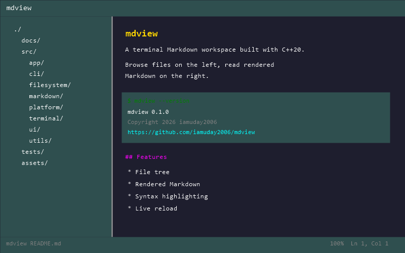

# mdview

A terminal **Markdown workspace**: browse a directory tree on the left, read
beautifully rendered Markdown on the right, and never leave the terminal.



```text
mdview .
```

---

## Quick Links

| Topic | Link |
| --- | --- |
| Features | [docs/features.md](docs/features.md) |
| Building | [docs/building.md](docs/building.md) |
| Usage | [docs/usage.md](docs/usage.md) |
| Keyboard Shortcuts | [docs/keys.md](docs/keys.md) |
| Markdown Support | [docs/markdown-support.md](docs/markdown-support.md) |
| Architecture | [docs/ARCHITECTURE.md](docs/ARCHITECTURE.md) |
| Testing | [docs/testing.md](docs/testing.md) |
| Project Layout | [docs/project-layout.md](docs/project-layout.md) |

## Highlights

* **Zero dependencies** — pure C++20, one CMake build, no vendored libraries.
* **Cross-platform** — Windows (MSVC), Linux (GCC/Clang), macOS (Clang).
* **107 tests** — header-only harness, covers parser, renderer, terminal, and CLI.

## Licence

Copyright (c) 2026 [iamuday2006](https://github.com/iamuday2006). All rights reserved.

Provided as-is for use and modification.

**Repository:** https://github.com/iamuday2006/mdview
